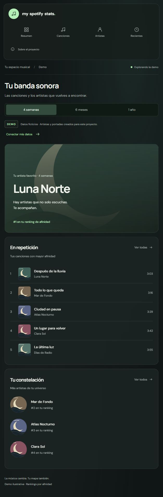
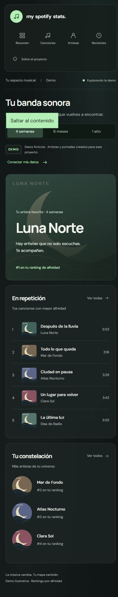

# Mood.i

Dashboard de portafolio con Angular 20, signals y glassmorphism oscuro. La demo pública permite explorar rankings sin cuenta. Los artistas, canciones y portadas de la demo son ficticios; el arte vectorial es original.

## Ejecutar

Usa Node 22.12+ compatible con Angular 20 (preferiblemente Node 22 o 24 LTS).

```powershell
cd bases
npm ci
npm start -- --host 127.0.0.1
```

Abre http://127.0.0.1:4200. La demo funciona sin configurar Spotify.

```powershell
npm run build
npm test -- --watch=false --browsers=ChromeHeadless
```

## Conectar Spotify

1. Crea una app en Spotify for Developers y autoriza las cuentas de prueba.
2. Abre **Conectar Spotify** en la app (ruta `/settings`) y guarda el **Client ID público**. Se conserva en este navegador; no agregues un client secret.
3. Registra exactamente `http://127.0.0.1:4200/callback` para desarrollo. Spotify requiere HTTPS en producción; registra también `https://TU-DOMINIO/callback`.
4. Pulsa **Conectar Spotify** y autoriza tu cuenta. No necesitas recompilar. El redirect URI se muestra en la sección de conexión; usa exactamente esa dirección al registrarla.

OAuth Authorization Code con PKCE SHA-256, validación de state, transacciones de diez minutos de un solo uso y renovación compartida de tokens. Se solicitan únicamente `user-top-read` y `user-read-recently-played`. Los tokens se guardan en sessionStorage de la pestaña y se borran al cerrar sesión; no hay backend ni base de datos. Como cualquier SPA, requiere mantener el código libre de XSS; sessionStorage no sustituye una sesión HTTP-only de un backend.

## Arquitectura

- `core`: modelos compartidos, MusicProvider, demo, Spotify y autenticación.
- `features`: bienvenida, dashboard con cuatro vistas, callback y explicación del proyecto.
- Rankings por afinidad para aproximadamente 4 semanas, 6 meses y 1 año. No se muestran minutos totales ni cantidades de reproducciones.
- Caché de Spotify en memoria por período durante dos minutos; se limpia al cerrar sesión.
- Errores 401: renovar una vez o pedir reconexión; 403: explicar restricción; 429: respetar Retry-After; red: permitir reintentar.
- Lazy routes; estado de fuente y período en la URL; signals para estados de carga y error.
- Tokens CSS, contraste, foco visible, skip link, movimiento reducido y fallback opaco sin backdrop-filter.

## Desplegar

Publica `bases/dist/bases/browser` después de compilar. En Vercel, establece `bases` como Root Directory; se incluye `vercel.json`. En Netlify, base `bases`, build `npm run build`, publish `dist/bases/browser`; se incluye `_redirects` para rutas SPA. La conexión necesita guardar el Client ID en la sección de conexión y registrar el callback HTTPS. También puede configurarse un Client ID público por defecto en `spotify-config.ts`. No se ha publicado automáticamente.

Las fuentes DM Sans y Manrope se sirven localmente con Fontsource; hay fallback sans-serif si no están disponibles. Las portadas demo no necesitan servicios externos.

## Limitaciones de Spotify

Development Mode requiere Premium al propietario y limita nuevas apps a cinco usuarios autorizados. El acceso público ampliado depende de la aprobación de Spotify. Ver [guía de migración](https://developer.spotify.com/documentation/web-api/tutorials/february-2026-migration-guide). Una demo no da acceso a datos reales de visitantes sin autorización.

Los rankings son afinidad, no historial completo. La fecha de la actividad demo es fija e ilustrativa. Los horarios se muestran en la zona local del visitante. Los datos reales dependen del historial disponible y los permisos de Spotify. Proyecto independiente, sin afiliación con Spotify.

## Caso de estudio

Consulta [las decisiones de producto y diseño](docs/CASE-STUDY.md). La página `/about` también presenta el proyecto a visitantes.

## Capturas y calidad





Desde la raíz, instala las herramientas con `npm ci` y las dependencias de la app con `npm run setup`. Los scripts `npm start`, `npm run build`, `npm test` y `npm run format:check` funcionan también desde la raíz. GitHub Actions ejecuta formato, build y pruebas en Node 22.
